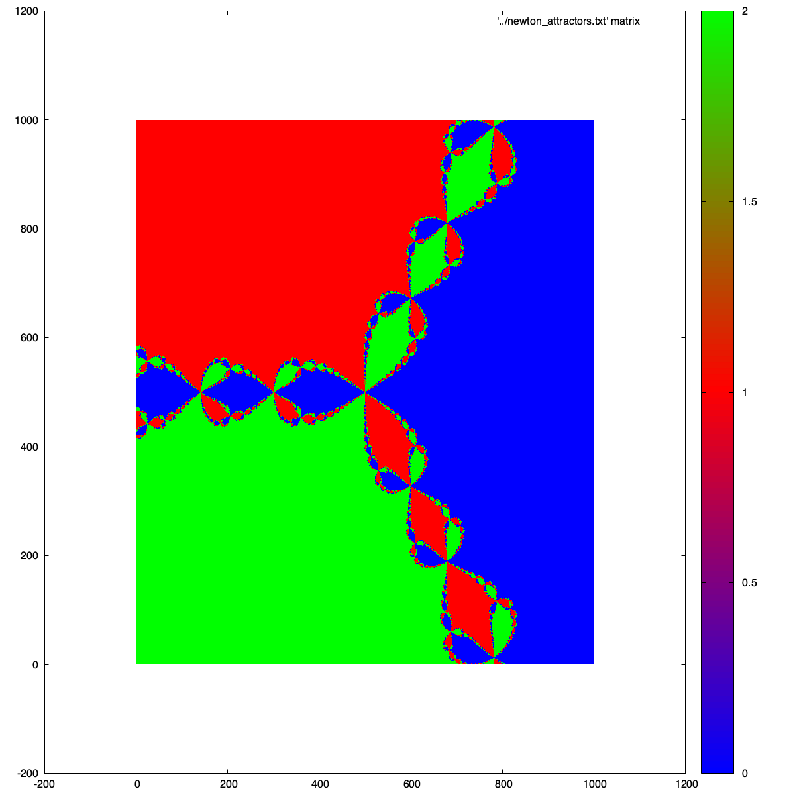

# Отчёт по лабораторной работе: Численные методы решения нелинейных уравнений

## Содержание

- [Цель работы ](#цель-работы)
-  [Ход выполнения работы](#ход-выполнения-работы)
    - [Метод дихотомии](#метод-дихотомии)
    - [Метод простой итерации](#метод-простой-итерации)
    - [Метод Ньютона](#метод-ньютона)
    - [Задание номер 1](#задание-номер-1)
    - [Задание номер 2](#задание-номер-2)
    - [Задание номер 3](#задание-номер-3)
- [Заключение](#заключение)

## Цель работы

Цели:

Реализовать метода для чсиленного решения нелинейных уравнений: метод Дихотомии, просто итерации, Ньютона. Сравнить сходимость, надёжность и скорость методов на задачах. Визуализировать области притяжения метода Ньютона для комплексных корней

## Ход выполнения работы 

### Метод дихотомии 

Метод дихотомии (бисекции) был реализован как универсальный надёжный способ поиска корня, основанный на делении отрезка пополам и анализе смены знака функции. Этот метод гарантированно сходится при наличии корня, но имеет низкую скорость (линейную сходимость). В ходе экспериментов дихотомия показала значительно большее число итераций и вызовов функции даже при умеренной точности.  Для данной задачи с гладкой функцией (ВАХ лампы накаливания) метод дихотомии оказался неэффективен, поскольку не использует никакой информации о производной и быстро уступает уточняющим методам по времени вычисления `Dihotomoia.h`

### Метод простой итерации 

Метод простой итерации (с подбором параметра tau) был реализован с попыткой применить его к задаче с нелинейной зависимостью температуры. На практике этот метод часто приводил к расходимости итераций: графики выходящих токов получились "шумными" и нереалистичными, а итерационная последовательность часто покидала диапазон поиска или уходила в нефизические значения. Для плавных, "крутых" нелинейных функций с высоким температурным коэффициентом метод простой итерации требует сложного подбора схемы и параметров, иначе он не работает или работает крайне неустойчиво

График расходимости рассмотрим в разделе, связанным с построением ВАХ лампы накаливания

Реализация метода простой итерации находится в файле `Iteration.h`

---

### Метод Ньютона

Метод Ньютона был реализован с классическим использованием производной, что позволило получить быструю квадратичную сходимость. В результате итерации сходились к корню за малое число шагов (в среднем 4–5 итераций) и давали физически корректную вольт-амперную характеристику лампы. ВАХ была гладкой, без выбросов, и совпадала с теоретическими ожиданиями. Численная оценка кратности корня показала, что для данной задачи корни простые, что подтверждает применимость метода Ньютона. По всем метрикам этот способ оказался лучшим: минимальное количество итераций и обращений к функции, высокая надёжность и корректность графиков

Реализация метода Ньютона находится в файле `Newton.h`

---

### Задание номер 1

Найдёс корень уравнения $$2\ln(x) - \cos(\ln(x)) + \sin(\ln(x)) = 0$$ на отрезке $$[1, 3]$$. Погрешность: $$ \epsilon = 10^{-10}$$:

**Таблица 1 - Сравнение результатов численного решения уравнения различными методами**
| Метод                   | Корни             | Кол-во итераций |
|-------------------------|-------------------|-----------------|
| Дихотомия               | 1.3748798223925   | 37487           |
| Простая итерация        | 1.3748798223924   | 230             |
| Ньютон                  | 1.3748798223928   | 3               |

Решение, которое даёт Wolfram: $\ x=1.37487982239283$
Получили, что наиболее точное решение получил мтеод Ньютона и ещё за меньшее количетсво итераций. Но посмотрев на время выполнения заметим, что Ньютон выполняется медленее всего, объясняется это тем, что в коде выполняется автоматический поиск приближения, из-за этого код требует много времени. Поставив начальное приближение близкое к решению, получим выполнение гораздо быстрее. Начальное приближение можно получить построив график. Дихотомия выполняется за большее количесвто итераций. Метод простой итерации на втором месте.

### Задание номер 2

Небольшой брусок A совершает гармонические колебания вдоль оси Ox
по закону $\ x= a \cdot \sin ω\cdot t$. Из точки B, находящейся на расстоянии $\l_0$ от начала координат,
в момент времени $\ t_0 = 0$ начинает двигаться другой брусок с постоянной скоростью $\ v_0$.
Через какое время τ бруски встретятся? Постройте график зависимости $\ τ(v_0)$.

Решаем уравнение :

$$
a\cdot \sin (\omega \cdot t)-l_0+V_0 \cdot t=0
$$

Задаём $\ a=1$ $\omega=1$ 
Решаем данное уравнение изменяя начальную скорость бруска $\ v_0 \in [1; 50.5]$
Выводим графики $\ \tau(v_0)$
Для метода Ньютона:
.png)

**График 2 Tau(V0) для Ньютона.**

Для метода Дихотомии:
.png)

**График 3 Tau(V0) для Дихотомии**

Для простой итерации:
.png)

**График 4 Tau(V0) для Простой итерации**

Получаем графики, которое можно объяснить физически, доказать, что они парвильные: при $\ \lim_{v_0 \rightarrow 0}\tau(v_0) =0$, то есть при стремлении начальной скорости бруска к нулю получаем время стремящееся к бесконечности, то еть они не столкнуться.

### Задание номер 3 

**График 5 - Области притяжения метода Ньютона для комплексных корней**

Внутри «большой» части области притяжения метод сходится быстро и стабильно. Чем ближе стартовая точка к границе между цветами, тем более непредсказуемо ведут себя итерации: небольшое смещение начальной точки может привести к сходимости к другому корню. Внутри «нормальной» области притяжения метод Ньютона работает предсказуемо и очень быстро (квадратичная сходимость). Вблизи фрактальной границы результат сильно зависит от выбора начального приближения, и метод может вести себя нестабильно. Сколь угодно близкие стартовые точки могут уйти к разным корням или вообще не сойтись.

## Заключение

В ходе работы сравнивались три численных метода решения нелинейного уравнения для физической задачи. Каждый метод хорош по-своему, поэтому для каждой задачи следует выбирать свой метод решения задач 
